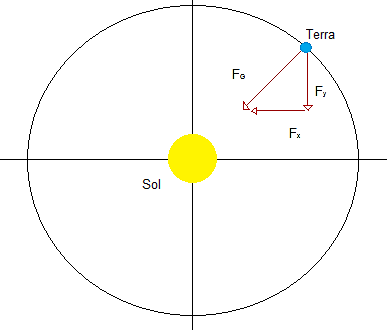
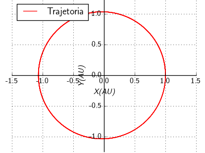
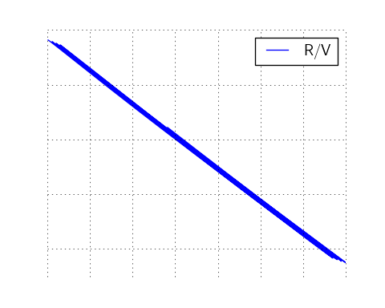
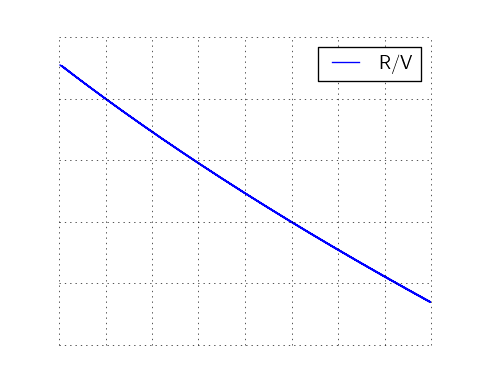
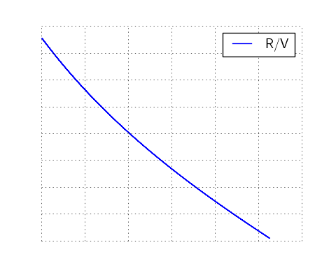
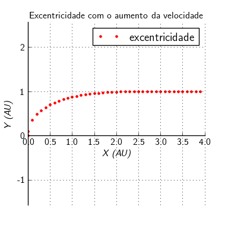

::: titlepage
::: center
[Universidade Federal Fluminense -UFF]{.smallcaps}

**Movimento planetário**

*Autor Bruno da Silva Machado*
:::
:::

# Introdução

O movimento planetário é aquele os planeta fazem ao redor de uma estrela
este movimento obedecem as leis de Kepler, que por sua vêz podem ser
obtidas pelas leis de Newton

Neste trabalho vamos estudar melhor este tipo de movimento analisar
algumas de suas características através de método numérico.

Usaremos o método de Verlet por sua simplicidade e estabilidade por nos
fornece uma boa aproximação numérica para o problema em questão.

# Estudo do Movimento Planetário

Considere um planeta girando em torno de uma estrela e a força entre
esses corpos é a gravidade. De acordo com a lei de gravitação universal
de Newton podemos descrever a força de interação entre os corpos como:
$$F_G = \frac{GM_sM_E}{r^{2}}$$

Onde $\ M_s$ e $\ M_E$ são a massa do Sol e da Terra por exemplo,$\ r$ e
a distancia entre eles, e $\ G$ é constante gravitacional. Agora vamos
assumir a massa do sol é suficientemente grande de modo que seu
movimento possa ser desprezado. Nos fazemos isto para calcular a posição
do planeta em funçâo do tempo. Aplicando a segunda lei de Newton do
movimento temos: $$\overrightarrow{F} = m\overrightarrow{a}$$
$$F(x,y) = m\left(\frac{d^{2}x}{dt^2}\textbf{i} + \frac{d^{2}y}{dt^2}\textbf{j}\right)$$
Fazendo $\ y = 0$ ou $\ x = 0$ na equação anterior temos que:
$$\frac{d^2x}{dt^2} = \frac{F_x}{m}$$
$$\frac{d^2y}{dt^2} = \frac{F_y}{m}$$ Onde $\ F_x$ e $\ F_y$ são
componentes da força gravitacional e dessa forma podemos reescreve-los
como: $$F_x = -\frac{GM_EM_E|x|}{x^3}\textbf{i}$$ e
$$F_y = - \frac{GM_EM_E|y|}{y^3}\textbf{j}$$ Onde o sinal negativo de
$\ F_x$ indica que a força esta direcionada para o Sol,quando este está
localizado na origem do sistema de coordenadas.

::: center
{width="3.87in" height="3.50in"}

Figura1. sistema de coordenadas para descrever o movimento da terra em
relação ao Sol. O Sol esta na origem do sistema. A força gravitacional
$F_g$ exerce força que mantem o planeta orbitando é um agente
responsável pelo período da terra.
:::

Agora vamos a abordagem usual de escrever as equações diferenciais de
segunda ordem em equação de primeira ordem.

$$\frac{d^2x}{dt^2} = \frac{d}{dt}\left(\frac{dx}{dt}\right)$$
$$\frac{d^2y}{dt^2} = \frac{d}{dt}\left(\frac{dy}{dt}\right)$$ dessa
forma temos: $$\frac{dx}{dt} = v_x$$
$$\frac{dv_x}{dt} = -\frac{GM_Sx}{r^3}$$

$$\frac{dy}{dt} = v_y$$ $$\frac{dv_y}{dt} = -\frac{GM_Sy}{r^3}$$

Estes podem ser convertidos em equações diferencias que podem ser
solucionado numericamente. no entanto, antes de proceder com isso, é
útil para considerar a escolha de unidades. Uma opção é simplesmente
usar unidades SI não há nenhuma dificuldade em usa-las, exceto que
metros e segundos não correspondem a escala do problema por exemplo, o
raio da órbita terrestre de é aproximadamente igual a $\ 1.5 x10^{11}$
m. Se usarmos as unidades SI, um gráfico que mostra a órbita em torno do
Sol teria rótulos de $\ 1x10^11, 2x10^11 m$, etc. Isso seria estranho,
embora não incrivelmente assim. é muito mais conveniente para usar as
unidades astronômicas, AU, que são definidas a seguir. uma unidade
astronômica de comprimento equivale a distância media entre o sol e da
terra que é aproximadamente $\ 1.5 X 1^11 m$. é conveniente para medir o
tempo em anos ($\ 1 ano \approx 3,2 X 10^7 S$) uma vez que esta unidade
coincide com o sistema solar melhor do que, por exemplo, segundos.
Vamos, portanto, usar unidades astronômicas de distância, e medir tempo
em anos, a menos que seja indicado e para completar o nosso sistema de
unidades também precisamos uma correspondéncia em unidade de massa. Este
é facilmente obtido se lembrarmos que a órbita da terra de é
aproximadamente, circular. para movimento circular nós sabemos que a
força deve ser igual a $\ M_Ev^2/r$, o que nos leva a:

$$F_G = \frac{M_Ev^2}{r} = \frac{GM_SM_E}{r^2}$$ onde V é a velocidade
da terra.

$$M_Ev^2r = GM_SM_E$$ $$GM_S = v^2r$$

lembrando que $\ v = \frac{2\pi}{r}$ e $\ r = 1AU$ temos então
$\ GM = 4\pi^2 AU^3/yr^2$

# Resultados

A partir das relações anteriores podemos chegar nas soluções numéricas

$$a_{x,t} = -\frac{4\pi^2x_t}{r_t^3}$$
$$x_{t+1} = x_t +v_{x,t+1}\Delta{t} + 1/2a_{x,t}\Delta{t}$$
$$v_{x,t+1} = v_{x,t} + a_{x,t}$$ $$a_{y,t} = -\frac{4\pi^2y_t}{r_t^3}$$
$$y_{t+1} = y_t +v_{y,t+1}\Delta{t} + 1/2a_{y,t}\Delta{t}$$
$$v_{y,t+1} = v_{y,t} + a_{y,t}$$

Para avaliar o que obtemos vamos exemplifica-lo seja $\Delta{t}$ o passo
temporal bem pequeno valendo 0.0001 ano e y a distancia no eixo das
ordenadas valendo 1AU e x = 0 a velocidade no eixo é vy = 2$\pi$ AU/ano
e no eixo das abcissas vx = 0.

::: center
{width="4.80in" height="3.84in"}

Figura2. terra orbitando o Sol.
:::

Como podemos ver acima a orbita da terra é uma circunferência de raio 1
AU, mas sabemos que das leis de Kepler que as orbitas dos planetas
descrevem uma elipse com o sol em um dos seus focos,porem como a orbita
terrestre e bem próxima de uma circulo (i.e.,sua excentricidade e de
apenas 0.017 que é um valor bem pequeno) nosso exemplo se aproxima de
maneira eficiente com a realidade

Aumentando um pouco a velocidade inicial acrescentando 0.1, 0.5 e 1 a
$v_y = 2\pi$, temos uma mudança na trajetória ela começa a se tornar
elíptica uma vez sua energia varia entre $V_{min} < E < 0$, podemos ver
isso nas figuras a seguir

::: center
{width="4.80in" height="3.84in"}

Figura 3.Para um acréscimo de 0.1, a trajetória não sofre uma mudança
drástica ao ponto de podermos notar algum tipo de diferença
significativa Mas é possível notar que o deslocamento da partícula se
estendeu para o lado esquerdo.
:::

::: center
{width="4.80in" height="3.84in"}

Figura 4.Agora, para um acréscimo de 0.5, está mais nítido o que foi
citado na figura anterior. A trajetória se estende para a esquerda e o
raio da \"circunferência\" aumenta.
:::

::: center
{width="4.80in" height="3.84in"}

Figura 5.Para um acréscimo de 1 a velocidade inicial, nota-se que a
trajetória prossegue se estendendo para a esquerda e é acrescentado para
ambos sentidos do eixo y.
:::

Notemos que quando a velocidade é acrescentada de algum valor a
trajetória aumenta e se estende para a esquerda. A velocidade
acrescentada foi em $v_y$ e o começo da trajetória do planeta está em
$X=1$ e $Y=0$. Então segue -se subindo com uma velocidade um pouco
maior, e da 2ª Lei de Kepler, a área percorrida pela Terra em um período
de tempo igual deve ser a mesma. Logo como a Terra tem velocidade maior
na parte positiva do eixo x, quando ela estiver fazendo a trajetória na
outra extremidade da elipse ela deve ter velocidade menor, pois deve
percorrer a mesma área.

porem exite um limite em que podemos aumentar a velocidade e manter a
orbita fechada. Supondo que ha conservação de energia temos que a
energia total e fornecida pela equação abaixo:

$$E = \frac{1}{2}mv^2 - \frac{GMm}{r}$$ onde v e x são o modulo da
velocidade e posição respectivamente.

como dito anteriormente para a orbita ser fechada $V_{min}< E < 0$
substituindo em (4) temos a seguinte inequação

$$\frac{1}{2}mv^2 - \frac{GMm}{r} < 0$$
$$\frac{1}{2}mv^2 < \frac{GMm}{r}$$ $$mv^2 < \frac{2GMm}{r}$$
$$v^2 < \frac{2GM}{r}$$ $$v < \sqrt{\frac{2GM}{r}}$$

A solução acima e familiar ela é a equação da velocidade de escape, ou
seja, para que a orbita seja fechada a velocidade do satélite de ser
menor que a de escape.

## Espaço de fase em x para velocidades diferentes

Vamos analisar agora o espaço de fase (em x) para cada caso de
velocidade diferente já apresentado. Na Figura 6 novamente não há uma
mudança significativa para algum tipo de análise, mas podemos notar que
o movimento conserva energia e que a velocidade matem a transição para x
positivo e negativo. A Figura 7 apresenta algumas características
diferentes em relação a primeira, mas vamos analisar melhor utilizando a
Figura 8, pois ela é a que deixa mais nítido o que ocorre quando a
velocidade é aumentada, os trechos em que ela se mantem são os ápices,
ou seja, quando $x = \pm1$ e $y = \pm1$, ou seja, a velocidade máxima e
mínima continuam as mesmas, mas a transição entre elas é diferente. Note
no gráfico da Figura 6 que a quando $x < 0$ a transição é mais longa que
quando $x > 0$.

::: center
{width="4.80in" height="3.56in"}

Figura 6. Gráfico com pouca informação sobre a alteração da velocidade.
:::

::: center
{width="4.80in" height="3.84in"}

Figura 7. Gráfico com ligeira mudança para $x<0$.
:::

::: center
{width="4.80in" height="3.84in"}

Figura 8. Gráfico com melhor informação sobre as consequências de mudar
a velocidade inicial do movimento.
:::

## Espaço de fase para velocidades diferentes

Agora, nas figuras a seguir temos o espaço de fase do 'raio' (distância
do centro da circunferência até a Terra) em relação ao módulo da
velocidade.

::: center
{width="4.80in" height="3.84in"}

Figura 9. Neste gráfico o raio sofre um pequeno aumento quando a
velocidade.
:::

::: center
{width="4.80in" height="3.84in"}

Figura 10. Gráfico com um aumento um pouco maior da velocidade inicial,
pode-se notar um aumento considerável de $v$ conforme $r$ aumenta.
:::

::: center
{width="4.80in" height="3.85in"}

Figura 11. Neste gráfico o aumento significativo de até um AU, a
velocidade diminui drasticamente.
:::

## Excentricidade da órbita

A excentricidade da órbita é dada por

$$e = \sqrt{1 - \frac{b^2}{a^2}}, \qquad \forall (b\leq a)$$

Usando o método de Verlet e fazendo um gráfico da excentricidade pelo
acréscimo da velocidade inicial (Figura 11), nota-se que a
excentricidade tende para 1, ou seja, o movimento representa uma elipse
com a diferença dos raios $a$ e $b$ aumentando e acaba por representar
uma parábola($e=1$).

::: center
{width="3.84in" height="3.84in"}
:::

# Conclusão

Concluímos que para orbitas circulares e elípticas as equações acima nos
fornecem uma boa aproximação em relação comas orbitas planetárias reais,
também e possível, através de ajustes, deduzimos e verificar a
veracidade da 3$^\circ$ lei de kepler e que a relação entre o período e
o raio da orbita dos planetas corre de forma logarítmica, e que as leis
de Kepler e algo bem mais geral podendo descrever e prever o movimento
de satélites e as leis de Newton são bem sucedidas em abordar as leis de
Kepler de forma analítica são peça fundamental para a analise numérica
feita neste trabalho

# Bibliografia

Bruno da Silva Machado, Leis de Kepler, 2017

N. J. Giordano & H. Nakanishi, Computational Physics, 2${}^\circ$ed,
2007

Método de Verlet, Wikipédia a enciclopédia livre, 2017

Sears & Zemansky, Física 2 Termodinâmica e ondas, 12${}^\circ$ed, 2008

Talita A.Anjos, Brasil Escola,2016
